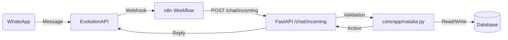

# 🧠 Natalia Architecture (AI Assistant)

## 1. Overview
Natalia is an autonomous agent responsible for:
1.  **Lead Qualification**: Filtering "Ghost" vs "Interested".
2.  **Scheduling**: Booking appointments for Jorge.
3.  **FAQ**: Answering pricing/location questions (RAG-lite).

## 2. Data Flow

## 3. State Machine (LeadStatus)
*   **NEW**: First interaction.
*   **CONTACTED**: Natalia sent greeting.
*   **INTERESTED**: User asked about price/service.
*   **BOOKED**: Appt confirmed.
*   **GHOST**: No reply for 24h.

## 4. Components
*   **`core/app/natalia.py`**: Logic Engine (Rules -> LLM).
*   **`core/app/routes/chat_routes.py`**: Interface.
*   **`workflows/n8n/Incoming_Chat_System.json`**: The router.

## 5. Knowledge Base
stored in `business_knowledge` table:
*   `pricing_microblading`
*   `location_main`
*   `promo_current`
