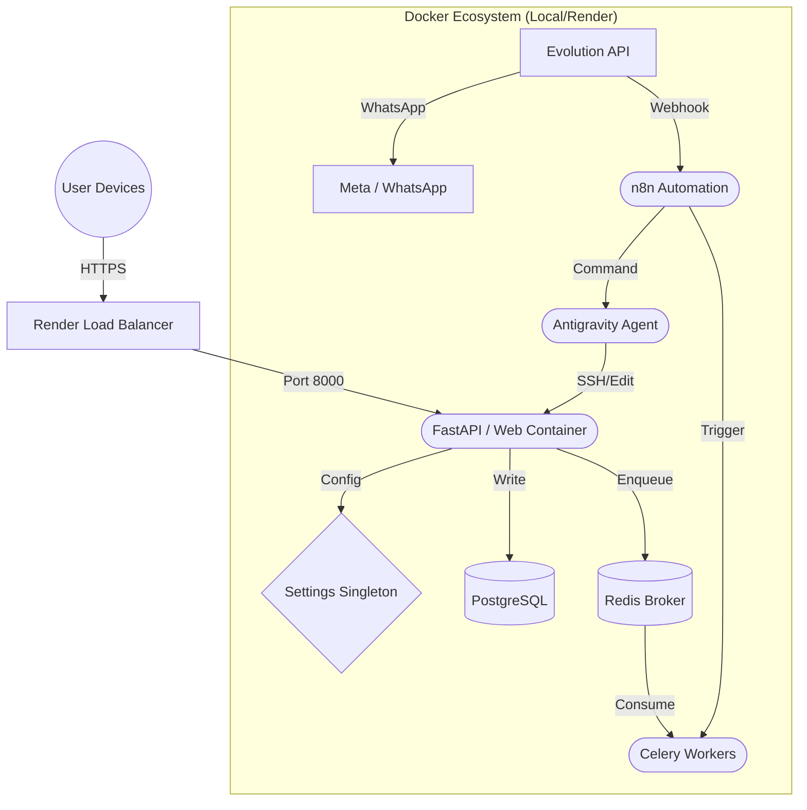

# 🗺️ PROJECT STRUCTURE MAP (Enhanced)

This document visualizes the architecture of **Jorge Aguirre Web** to guide the Distributed Intelligence Triad.

## 🧱 High-Level Architecture

## 📂 Directory Topography

### 🟢 `core/` (The Application Heart)
- **`app/`**: Python logic (Routes, Models, Services).
- **`database/`**: Migrations & SQLite Fallback.
- **`static/`**: Frontend Assets (Images, CSS, JS).
- **`templates/`**: Jinja2 UI.

### 🟡 `automation/` (The Nervous System)
- Contains n8n Workflow JSONs.
- "Natalia" CRM Logic definitions.

### 🔴 `infrastructure/` (The Skeleton)
- `docker/`: Dockerfiles for auxiliary services.
- `antigravity.Dockerfile`: Local AI Agent definition.

---

---
*Synchronized with CAPACIDADES_Y_ORDENES.md*
